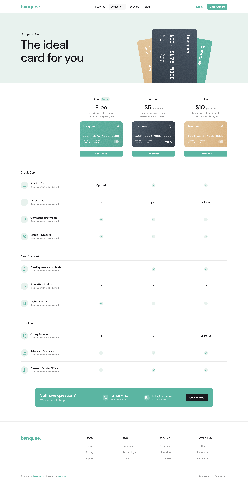
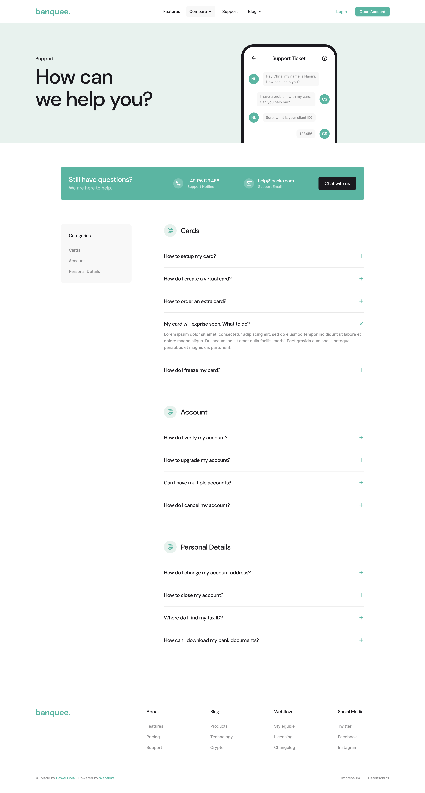

# Banquee - SaaS & Bank Website

A high-performance banking platform interface crafted for speed and responsiveness. Built using the latest Next.js 16 and Tailwind CSS 4, featuring a modular component architecture with Radix UI and Shadcn

[](https://banquee-sass-and-bank-website.vercel.app/)
[](https://github.com/herihermansyah/banquee-sass-and-bank-website)

---

## 📸 Design Preview
A visual overview of the project design:

<p align="center">
  
  
  
  
  
</p>

## 🚀 Key Features
- **Cutting-Edge Stack**: Built with the latest Next.js 16.2 (App Router) and React 19.
- **Next-Gen Styling**: Implemented using Tailwind CSS v4 for optimized performance and modern configurations.
- **React Compiler**: Leveraged React 19’s latest features for superior rendering efficiency.
- **Responsive & Pixel-Perfect**: Seamlessly adapted for mobile, tablet, and desktop views with a focus on high-fidelity design.
- **Modular Components**: Structured using Radix UI and Shadcn for accessible and reusable UI elements.

## 🛠️ Technology Stack
This project utilizes the most modern web technologies available:

- **Framework**: [Next.js 16.2+](https://nextjs.org/)
- **Library**: [React 19](https://react.dev/)
- **Styling**: [Tailwind CSS 4](https://tailwindcss.com/)
- **UI Components**: [Shadcn UI](https://ui.shadcn.com/) & [Radix UI](https://www.radix-ui.com/)
- **Language**: [TypeScript](https://www.typescriptlang.org/)
- **Icons**: [Lucide React](https://lucide.dev/)

## 💻 Getting Started

To run this project locally, follow these steps:

1. **Clone the repository:**
   ```bash
   git clone [https://github.com/herihermansyah/banquee-sass-and-bank-website.git](https://github.com/herihermansyah/banquee-sass-and-bank-website.git)
   ```

2. **Navigate to the directory:**
   ```bash
   cd banquee-sass-and-bank-website
   ```

3. **Install dependencies:**
   ```bash
   npm install
   ```

4. **Start the development server:**
   ```bash
   npm run dev
   ```

5. **Open your browser:**
   Go to [http://localhost:3000](http://localhost:3000) to see the result.

## 👤 Author
**Heri Hermansyah**
